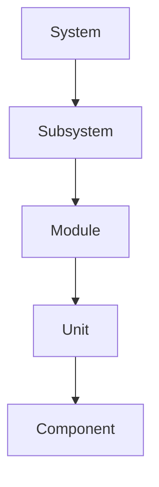
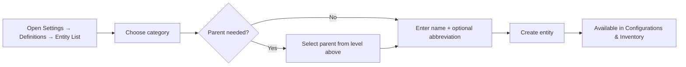
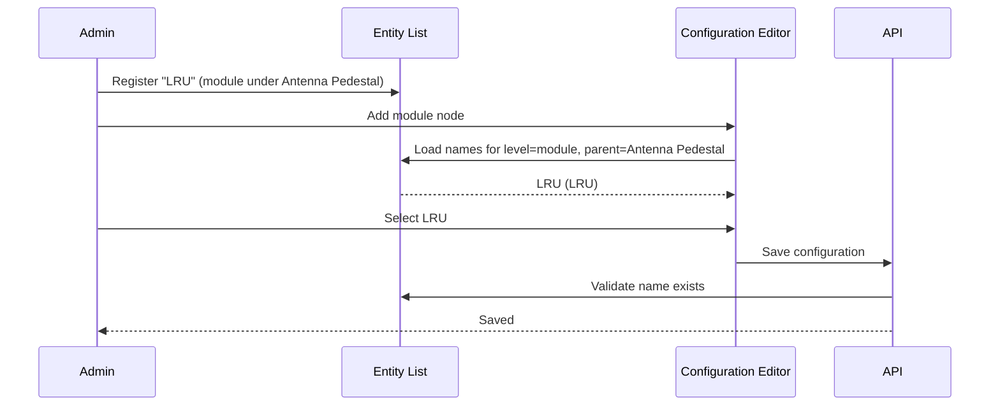
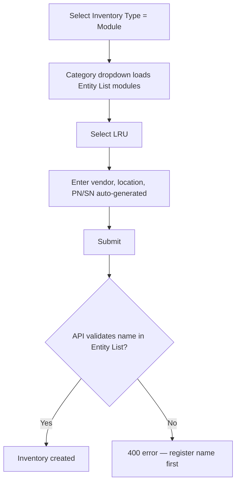

# Entity List — User Guide

The **Entity List** is the master catalog of hardware entity **names** (e.g. *Antenna Pedestal*, *LRU*, *ACU*) and **categories** (hierarchy levels: *System*, *Subsystem*, *Module*, *Unit*, *Component*). Every name used in the application must first be registered here.

> **Location:** Settings → Definitions → **Entity List**  
> **URL:** `/settings?tab=definitions&section=entity-list`

---

## Why the Entity List exists

Before stocking inventory or defining a project configuration, the organization must agree on the allowed entity names and how they nest under one another. The Entity List is that single source of truth.

| Without Entity List | With Entity List |
|---------------------|------------------|
| Ad-hoc free-text names in forms | Controlled vocabulary |
| Typos and duplicates across projects | Consistent naming |
| Configurations and inventory out of sync | Same names everywhere |

**Enforcement:** The API rejects inventory items, hardware records, and configuration nodes whose `name` is not registered in the Entity List for the selected category (and parent, when applicable).

---

## Concepts

| Term | Meaning | Example |
|------|---------|---------|
| **Name** | The display / catalog name of an entity type | `Antenna Pedestal`, `LRU`, `Harness Antenna` |
| **Category** | The hierarchy level (`hierarchy_type`) | `system`, `subsystem`, `module`, `unit`, `component` |
| **Parent** | Required for all categories except System | Subsystem *LRU* belongs under System *ACU* |
| **Abbreviation** | Short code used in PN/SN templates | `AP`, `LRU`, `HA` |

### Category hierarchy



| Category | Parent required? | Example name |
|----------|------------------|--------------|
| System | No | ACU |
| Subsystem | System | Antenna Pedestal |
| Module | Subsystem | LRU |
| Unit | Module | Power Supply Unit |
| Component | Unit | Connector J1 |

---

## Admin workflow — building the Entity List



### Step-by-step

1. Go to **Settings → Definitions → Entity List**.
2. Choose the **category** (level) — e.g. *System*.
3. For levels below System, select the **parent** from the level above.
4. Enter the **name** (e.g. `Antenna Pedestal`) and optional **abbreviation** (`AP`).
5. Click **Create**.

### Example catalog

| ID | Name | Category | Parent | Abbreviation |
|----|------|----------|--------|--------------|
| 1 | ACU | system | — | ACU |
| 2 | Antenna Pedestal | subsystem | ACU | AP |
| 3 | LRU | module | Antenna Pedestal | LRU |
| 4 | Power Supply | unit | LRU | PSU |
| 5 | Connector J1 | component | Power Supply | CJ1 |

### Batch import (JSON)

Admins with **Create Hierarchy** permission can upload a JSON array:

```json
[
  { "name": "ACU", "hierarchy_type": "system", "abbreviation": "ACU" },
  { "name": "Antenna Pedestal", "hierarchy_type": "subsystem", "parent_id": 1, "abbreviation": "AP" },
  { "name": "LRU", "hierarchy_type": "module", "parent_id": 2, "abbreviation": "LRU" }
]
```

| Field | Required | Notes |
|-------|----------|-------|
| `name` | Yes | Display name |
| `hierarchy_type` | Yes | One of: `system`, `subsystem`, `module`, `unit`, `component` |
| `parent_id` | For non-system levels | Database ID of the parent entity |
| `abbreviation` | No | Used in identifier templates |
| `description` | No | Optional notes |

---

## Using the Entity List — Configurations

**Path:** Settings → Definitions → **Configurations**

When building an SDLS hierarchy configuration template, you **pick** entities from the Entity List — you cannot type arbitrary names.



### Example — adding a module to a configuration

1. Ensure **Antenna Pedestal** (subsystem) and **LRU** (module) exist in the Entity List with the correct parent chain.
2. Open a configuration → add a **System** node → select **ACU**.
3. Add **Subsystem** under ACU → select **Antenna Pedestal**.
4. Add **Module** under Antenna Pedestal → select **LRU** from the dropdown.
5. Save the configuration.

If **LRU** is not in the Entity List, the dropdown will be empty and the API will reject a manual save.

---

## Using the Entity List — Inventory

**Path:** Inventory → **Add item**

| Form field | Maps to | Source |
|------------|---------|--------|
| Inventory Type | Category | Fixed level list (system … component) |
| Category | Entity **name** | Entity List filtered by selected type |
| Vendor | OEM name | Free text (used in PN/SN templates) |



### Example — stock an LRU module

1. Confirm **LRU** exists in Entity List as `module` (with correct parent).
2. Inventory → Add → **Inventory Type:** Module.
3. **Category:** select **LRU**.
4. Enter vendor (e.g. `Collins`), location, and other required fields.
5. Save.

---

## Using the Entity List — Installed hardware

When creating Systems, Subsystems, Modules, Units, or Components from their respective list pages, the **Name** dropdown is also sourced from the Entity List. Parent context (e.g. which System a Subsystem belongs to) further filters available names.

| Page | Category | Parent filter |
|------|----------|---------------|
| Systems | system | — |
| Subsystems | subsystem | Selected system's name |
| Modules | module | Selected subsystem's name |
| Units | unit | Selected module's name |
| Components | component | Selected unit's name |

---

## Identifier templates (Labels & templates)

PN/SN preview on **Labels & templates** uses the first Entity List entry for the selected level. Abbreviations from the Entity List feed the `{entityAbbr}` placeholder in templates.

Example template: `{levelAbbr}-{entityAbbr}-{vendor}-{seq:04d}`  
With ACU / AMP / seq 10 → `SYS-ACU-AMP-0010`

---

## Permissions

| Action | Permission |
|--------|------------|
| View Entity List | `view_hierarchy` |
| Add / edit / delete entries | `create_hierarchy`, `edit_hierarchy`, `delete_hierarchy` |
| Manage configurations | `hierarchy_config_manage` |
| Stock inventory | `create_inventory` |

---

## Troubleshooting

| Problem | Cause | Fix |
|---------|-------|-----|
| Category dropdown empty in Inventory | No entities registered for that level | Add names in Entity List |
| Submodule dropdown empty | No entities under selected parent | Add child entity with correct parent |
| Configuration save fails | Node name not in Entity List | Register name or pick from dropdown |
| "Not a registered …" API error | Name/category/parent mismatch | Verify Entity List entry matches context |

---

## Quick reference — end-to-end example

**Goal:** Stock inventory and use in a project configuration for an LRU under ACU → Antenna Pedestal.

| Step | Where | Action |
|------|-------|--------|
| 1 | Entity List | Add System **ACU** |
| 2 | Entity List | Add Subsystem **Antenna Pedestal** (parent: ACU) |
| 3 | Entity List | Add Module **LRU** (parent: Antenna Pedestal) |
| 4 | Configurations | Build template: ACU → Antenna Pedestal → LRU |
| 5 | Inventory | Type=Module, Category=LRU, receive stock |
| 6 | Project | Approve project → hierarchy generated from configuration |

---

## Related documentation

- [Hierarchy configuration spec](./workflow-specs/01-hierarchy-configuration.md)
- [Hierarchy generation](./workflow-specs/03-hierarchy-generation.md)
- [Inventory workflow](./workflow-specs/04-inventory-reservation.md)
