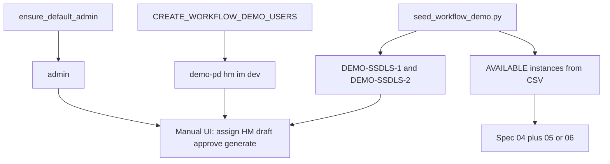

# Workflow Manual-Testing Groundwork

## Goal

Make it possible to walk specs in [`docs/workflow-specs/`](c:\VSCode\plcm\frontend\plcm-frontend\docs\workflow-specs) by hand with:

- One login per role (Admin, PD, HM, IM, Dev)
- Two hierarchy configs (SSDLS-1 / SSDLS-2) with node names that match demo stock
- Enough `AVAILABLE` inventory (with serial instances) for reservation, contention, and shortage/FCFS
- A repeatable reset path via fixtures + a CLI seed script
- A written guide that breaks setup and each early spec into short steps

**Default scope for this groundwork:** foundation through Spec 06 (roles → configs → project → generate → reserve → shortage → expiry). Specs 07–13 reuse the same accounts/stock; the guide will note “continue from here” without pre-staging issued/under-test inventory yet.

---

## What already exists (reuse)

| Piece | Location | Action |
|-------|----------|--------|
| Demo users (PD/HM/IM/Dev) | [`app/services/workflow_demo_users.py`](c:\VSCode\plcm\backend\plcm-backend\app\services\workflow_demo_users.py) | Enable via `CREATE_WORKFLOW_DEMO_USERS=true` |
| Default Admin | `ensure_default_admin` in [`app/auth.py`](c:\VSCode\plcm\backend\plcm-backend\app\auth.py) | Already on by default (`admin` / `password@82768243`) |
| Status vocabulary | [`workflow_foundation_seed.py`](c:\VSCode\plcm\backend\plcm-backend\app\services\workflow_foundation_seed.py) | Already runs on startup |
| Config create API/service | [`hierarchy_config_service.create_configuration`](c:\VSCode\plcm\backend\plcm-backend\app\services\hierarchy_config_service.py) | Call from seed script (same pattern as tests) |
| Proper stock instances | [`inventory_service.create_inventory_instance`](c:\VSCode\plcm\backend\plcm-backend\app\services\inventory_service.py) | Use this — **not** bare CSV HTTP import alone |

**Important constraint:** HTTP `POST /inventory/import-csv/` only allows Admin/SubAdmin (`is_inventory_manager`), and it creates parent `Inventory` rows without the same instance semantics the reservation tests rely on. The seed script will read a CSV fixture and create groups + `InventoryInstance` rows with `AVAILABLE` status (mirroring [`tests/test_inventory_reservation.py`](c:\VSCode\plcm\backend\plcm-backend\tests\test_inventory_reservation.py) `_stock_for_system`).

Reservation matching is by **hierarchy node name** (e.g. system `"Comm"`). Demo inventory `name` values must match config template node names.

---

## Deliverables

### 1. Backend fixtures (checked in)

Under [`plcm-backend/fixtures/workflow-demo/`](c:\VSCode\plcm\backend\plcm-backend):

- **`hierarchy_configs.json`** — two idempotent configs:
  - `DEMO-SSDLS-1` — product type SSDLS-1 (HDR), template tree System→Subsystem→… deep enough for Spec 03 (at least System + Subsystem like tests; prefer a small full path System→Subsystem→Module→Unit→Component for realism)
  - `DEMO-SSDLS-2` — product type SSDLS-2 (LDR), second tree for Spec 01 multi-config / Spec 12 later; mark available
- **`inventory_demo.csv`** — columns aligned with import contract plus seed needs: `name`, `inventory_type`, `part_number`, `serial_number`, `quantity`, `location`, `description`  
  - Multiple serials for shared node names used in reservation (e.g. several `Comm` / `RF` units)  
  - Extra units of one PN for shortage/FCFS (Spec 05)  
  - At least one single shared serial for contention scenarios  
  - Stable serial prefixes like `DEMO-SN-…` so re-runs are easy to spot/clean

### 2. CLI seed script

[`plcm-backend/scripts/seed_workflow_demo.py`](c:\VSCode\plcm\backend\plcm-backend\scripts\seed_workflow_demo.py):

- Load `.env` / use existing DB engine
- Ensure workflow statuses (call existing ensure)
- Ensure demo users even if env flag was off for this run (or print clear “set flag and restart” — prefer **also creating users from the script** so one command is enough)
- Upsert hierarchy configs by stable `code` (`DEMO-SSDLS-1` / `DEMO-SSDLS-2`) — skip or refresh if already present (idempotent)
- Read CSV → for each row, find-or-create inventory group by `(name, inventory_type, part_number)` and create missing serial instances as `AVAILABLE`
- Print a short summary: users, configs, instance counts
- Flags: `--dry-run`, `--inventory-only`, `--configs-only` (keep simple; no full DB wipe)

**Do not** auto-create projects in the default run — you will create them in the UI while testing Specs 02–03 (that *is* the workflow). Optional later: `--with-ready-project` if you want a jump-to-Spec-04 shortcut; defer unless you ask for it during execution.

### 3. Env / docs wiring (backend)

- Add `CREATE_WORKFLOW_DEMO_USERS=true` to [`.env.example`](c:\VSCode\plcm\backend\plcm-backend\.env.example) with a one-line comment
- Ensure your local `.env` gets the flag during execution (you confirm before we edit secrets)

### 4. Manual testing guide (frontend docs)

New file: [`plcm-frontend/docs/workflow-specs/MANUAL_TESTING_GUIDE.md`](c:\VSCode\plcm\frontend\plcm-frontend\docs\workflow-specs\MANUAL_TESTING_GUIDE.md)

Structure (easy steps):

1. **Prerequisites** — Postgres up, backend `uvicorn`, frontend `npm run dev`, migrations if needed
2. **One-time / repeatable seed** — set env flag → restart API → run `python scripts/seed_workflow_demo.py` → expected console output
3. **Account cheat sheet** — table of usernames/passwords/roles (from `workflow_demo_users.py` + admin)
4. **Fixture map** — which config codes and which inventory names/serials support which scenarios
5. **Walkthrough by spec (00–06)** — for each: login as X → click/path → expected status → logout → next role  
   - Spec 00: permission smoke (each role can/can’t do key actions)  
   - Spec 01: Admin views/creates configs (verify seeded ones; optionally toggle availability)  
   - Spec 02–03: PD assign HM → HM draft (2 flights × 3 SDLS) → Admin approve → HM generate → `READY_FOR_INVENTORY`  
   - Spec 04: HM reserve using seeded stock; release one  
   - Spec 05–06: note current product status + how to exercise shortage/expiry if implemented  
6. **Reset** — re-run seed (idempotent adds); how to spot `DEMO-*` data; when a DB reset is needed
7. Link from [`00-README.md`](c:\VSCode\plcm\frontend\plcm-frontend\docs\workflow-specs\00-README.md)

Also fill or replace the empty [`docs/testing_prompt.md`](c:\VSCode\plcm\frontend\plcm-frontend\docs\testing_prompt.md) with a short pointer to that guide (so the open file becomes useful).

---

## Execution phases (we do together after you approve)

| Phase | What we do | You do |
|-------|------------|--------|
| A | Add fixtures + seed script + `.env.example` + guide | Approve plan |
| B | Set `CREATE_WORKFLOW_DEMO_USERS=true` in local `.env`, restart backend | Confirm DB is the one you want |
| C | Run seed script; verify summary | Login once as each demo user |
| D | Follow guide Spec 01–03 to produce a ready project | Drive the UI; I help if a step fails |
| E | Spec 04+ with seeded inventory | Manual reserve / shortage checks |

---

## Out of scope for this groundwork pass

- Pre-seeding issued / under-test / recall dispositions (Specs 07–11)
- Changing `is_inventory_manager` so `demo-im` can use CSV import UI (possible follow-up; seed script bypasses this)
- Auto-seeding inventory on every API startup (CLI keeps demos intentional and repeatable)
- Committing or pushing unless you ask
